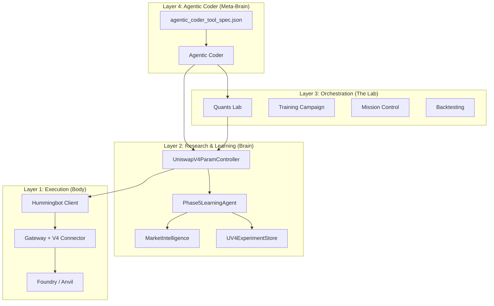
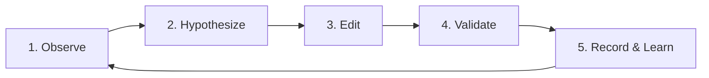

# Agentic Coder Architecture

> **Goal:** Define how an *Agentic Coder* (LLM + tools) can safely extend and maintain the Hummingbot + Quants Lab + Phase5 Learning Agent stack.

---

## 1. High-Level Stack



| Layer | Components | Responsibility |
|-------|------------|----------------|
| **1 – Execution** | Hummingbot, Gateway, Foundry/Anvil | Run strategies, execute swaps, simulate on forks |
| **2 – Brain** | Phase5LearningAgent, MarketIntel, UV4ExperimentStore, Controller | Learn from data, propose params, record outcomes |
| **3 – Lab** | Quants Lab, Training Campaign, Mission Control | Orchestrate experiments, backtest, visualize |
| **4 – Meta-Brain** | Agentic Coder + Tool Spec | Safely evolve code, run tests, validate changes |

---

## 2. Core Components

### 2.1 UniswapV4ParamController

The **single gate** through which all parameter decisions must pass.

**File:** [`quants-lab/controllers/uniswap_v4_param_controller.py`](file:///home/a/.gemini/antigravity/scratch/quants-lab/controllers/uniswap_v4_param_controller.py)

```python
class UniswapV4ParamController:
    def propose_config(self, market_intel: Dict) -> Config:
        """Given current intel/regime, propose a new config."""

    def validate_config(self, config: Config) -> ValidationResult:
        """
        Safety checks:
        - Bounds on spread, size, inventory, refresh_interval
        - Regime-aware sanity (e.g., avoid high_vol_low_liquidity)
        Returns: {is_valid: bool, errors: [...]}
        """

    def to_yaml(self, config: Config) -> str:
        """Serialize for v2_with_controllers.py."""

    def record_outcome(self, run_summary: Dict) -> None:
        """Push result to UV4ExperimentStore / DB."""
```

**Execution Flow:**
1. MarketIntelligence → regime, volatility, MEV risk, tradeable
2. `propose_config(intel)` → candidate params
3. `validate_config(config)` → hard clamps + risk checks
4. `to_yaml(config)` → YAML for Hummingbot
5. Run executes via `v2_with_controllers.py`
6. `record_outcome(...)` → archives to UV4ExperimentStore

---

## 3. Agentic Coder Tool Surface

**File:** [`agentic_coder_tool_spec.json`](file:///home/a/.gemini/antigravity/scratch/quants-lab/agentic_coder_tool_spec.json)

### 3.1 File Tools

| Tool | Access | Restrictions |
|------|--------|--------------|
| `read_file(path)` | Read-only | `quants-lab/`, `hummingbot/`, `conf/`, `test/` |
| `write_file(path, content)` | Write | Whitelisted dirs only, no secrets |

**Blocked:**
- `.env*`, `*.pem`, `*.key`
- `conf/wallets/**`, `certs/**`
- Any file matching `*_PRIVATE_KEY`, `*_API_KEY`

### 3.2 Shell Tools (Allowlisted)

| Tool | Wraps |
|------|-------|
| `run_pytests(target)` | `python3 -m pytest <target>` |
| `run_training_campaign(episodes)` | `./start_training_campaign.sh` |
| `run_foundry_tests()` | `forge test ...` |
| `build_gateway()` | `npm run build` |

Returns structured:
```json
{"success": true, "exit_code": 0, "stdout": "...", "stderr": "..."}
```

### 3.3 Domain Tools (High-Level APIs)

| Tool | Description |
|------|-------------|
| `get_market_intel(pool, pair)` | Returns structured intel from MarketIntelligence |
| `run_learning_campaign(episodes)` | Multi-episode training with safety flags |
| `load_experiments(min_version, filters)` | Query UV4ExperimentStore |
| `propose_config(market_intel)` | Controller.propose_config + validate |
| `simulate_v4_trade(params)` | Gateway + Foundry simulation |
| `check_secrets_configured()` | Returns `{KEY: bool}` without exposing values |

> **Key:** The Agentic Coder **never calls raw web3**. All execution flows through audited, testable interfaces.

---

## 4. Safety & Guardrails

### 4.1 Hard Boundaries ❌

The Agentic Coder **must not**:

- ❌ Deploy to production/mainnet without human approval
- ❌ Bypass simulation and test suites
- ❌ Call raw `anvil` or direct RPC (must use AnvilManager)
- ❌ Edit `.env`, keyfiles, private keys, risk-limit configs
- ❌ Make arbitrary external HTTP requests

### 4.2 Soft Constraints ⚠️

The Agentic Coder **should**:

- ⚠️ Run Foundry/Gateway tests for V4 execution changes
- ⚠️ Run backtests for strategy/reward logic changes
- ⚠️ Break large refactors into small, reviewable units
- ⚠️ Tag all changes with `experiment_version`, `training_phase`, `intel_quality`

### 4.3 All Changes Must Flow Through

```
UniswapV4ParamController
        ↓
Foundry Simulation
        ↓
Gateway V4 Connector
        ↓
UV4ExperimentStore / Quants Lab DB
```

---

## 5. Lifecycle: How the Agentic Coder Evolves the System



| Phase | Actions |
|-------|---------|
| **Observe** | `load_experiments`, Mission Control → see rewards, failures, gas costs |
| **Hypothesize** | Propose: strategy tweak, reward adjustment, new intel feature |
| **Edit** | `read_file`/`write_file` → modify agent, controller, tests |
| **Validate** | `run_pytests`, `run_foundry_tests`, `simulate_v4_trade` |
| **Record** | New runs → UV4ExperimentStore → agent updates `(regime, params) → reward` |

---

## 6. Next Concrete Steps

### TODO: Controller Wiring
- [ ] Implement `UniswapV4ParamController.record_outcome()` → DB-backed
- [ ] Add CLI: `python3 controllers/uniswap_v4_param_controller.py --dry-run`
- [ ] Make `v2_with_controllers.py` load YAML from `to_yaml()`

### TODO: Tool Spec Finalization
- [x] Create `agentic_coder_tool_spec.json`
- [x] Add `secrets_management` section
- [ ] Expose tools via HTTP/gRPC service (optional)

### TODO: Database Migration
- [ ] Implement `UV4ExperimentStore.save_run()` → SQL/MongoDB
- [ ] Maintain `experiment_version`, `intel_quality`, `training_phase`

### TODO: Backtesting Integration
- [ ] Wire Controller to Quants Lab backtesting engine
- [ ] Enable historical replay for parameter optimization

---

## 7. Related Files

| File | Purpose |
|------|---------|
| [uniswap_v4_param_controller.py](file:///home/a/.gemini/antigravity/scratch/quants-lab/controllers/uniswap_v4_param_controller.py) | Controller interface |
| [agentic_coder_tool_spec.json](file:///home/a/.gemini/antigravity/scratch/quants-lab/agentic_coder_tool_spec.json) | Tool definitions |
| [SECRETS_MANAGEMENT.md](file:///home/a/.gemini/antigravity/scratch/quants-lab/SECRETS_MANAGEMENT.md) | Secret handling policy |
| [phase5_learning_agent.py](file:///home/a/.gemini/antigravity/scratch/quants-lab/phase5_learning_agent.py) | Learning Agent (Brain) |
| [market_intel.py](file:///home/a/.gemini/antigravity/scratch/quants-lab/lib/market_intel.py) | Market Intelligence |
| [uv4_experiments.py](file:///home/a/.gemini/antigravity/scratch/quants-lab/lib/uv4_experiments.py) | Experiment Store |
