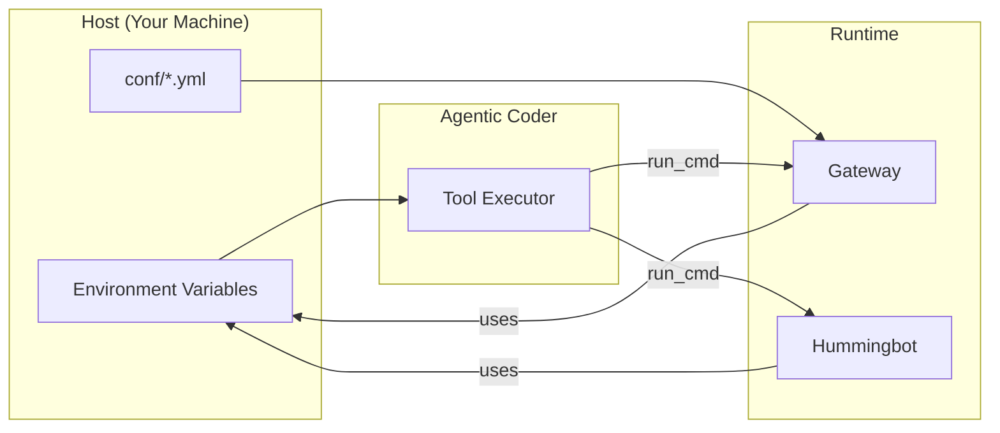

# Secrets Management for Agentic Coder

This document defines how the Agentic Coder handles sensitive credentials.

## Principle: Zero-Knowledge Secrets

The Agentic Coder **never sees, stores, or logs** actual secret values.
It can:
- ✅ Check if a secret **is set** (e.g., `os.getenv("KEY") is not None`)
- ✅ Run commands that **use** secrets (if pre-configured in environment)
- ❌ **Read** secret values
- ❌ **Write** secret values
- ❌ **Log** or print secret values

---

## Secrets Inventory

| Secret | Source | Used By |
|--------|--------|---------|
| `WALLET_PRIVATE_KEY` | Environment | Gateway V4 Connector |
| `DUNE_API_KEY` | Environment | DuneClient (MarketIntel) |
| `GATEWAY_PASSPHRASE` | Environment / Arg | Gateway HTTPS mode |
| `INFURA_API_KEY` | conf/rpc/infura.yml | Ethereum RPC |
| `HELIUS_API_KEY` | conf/rpc/helius.yml | Solana RPC |
| `ETHERSCAN_API_KEY` | conf/chains/ethereum.yml | Gas estimation |

---

## Blocked Patterns (Agentic Coder)

The following are **explicitly blocked** from read/write/log:

### File Patterns
```
.env
.env.*
*.pem
*.key
conf/wallets/**
certs/**
```

### Environment Variable Names
```
*_PRIVATE_KEY
*_SECRET_KEY
*_API_KEY
*_PASSPHRASE
*_PASSWORD
*_TOKEN (if contains auth)
```

### Grep/Search Exclusions
The agent must never run searches that would expose secrets:
```bash
# BLOCKED
grep -r "PRIVATE_KEY" .
cat .env
cat conf/wallets/*

# ALLOWED
grep -r "PRIVATE_KEY" . --include="*.py" | grep -v "os.getenv"  # Only see usage patterns
```

---

## Implementation: Secret Injection

Secrets flow into the system via **environment variables** set by the host, not by the agent.



### Before Running
The human operator sets secrets:
```bash
export WALLET_PRIVATE_KEY="0xabc..."
export DUNE_API_KEY="dune_xxx..."
export GATEWAY_PASSPHRASE="..."
```

### Agent Invokes
```python
# Agent calls:
run_cmd("npm run start -- --dev", cwd="/gateway")

# Gateway process inherits environment, uses WALLET_PRIVATE_KEY
# Agent never sees the value
```

---

## Validation Tools

The agent CAN check if secrets are configured (without seeing values):

```python
# ALLOWED: Check if set
def check_secrets_configured() -> dict:
    return {
        "WALLET_PRIVATE_KEY": os.getenv("WALLET_PRIVATE_KEY") is not None,
        "DUNE_API_KEY": os.getenv("DUNE_API_KEY") is not None,
        "GATEWAY_PASSPHRASE": os.getenv("GATEWAY_PASSPHRASE") is not None,
    }
```

This returns `{"WALLET_PRIVATE_KEY": True, ...}` without exposing values.

---

## Emergency: Key Rotation

If a key is suspected compromised:

1. **Human Action**: Rotate key via provider (Infura dashboard, Dune settings, new wallet).
2. **Human Action**: Update environment variables.
3. **Agent Action**: Re-run validation to confirm new key is set.
4. **Agent Action**: Run smoke test to confirm connectivity.

The agent **cannot** generate or store new keys.

---

## Recommendations for Production

1. **Use a secrets manager** (HashiCorp Vault, AWS Secrets Manager, 1Password CLI).
2. **Inject at runtime** via Docker/K8s secrets, not files.
3. **Separate dev/prod keys**: Dev uses Anvil (fake key), Prod uses real key.
4. **Audit logs**: Log *who* accessed secrets, not *what* they contain.
